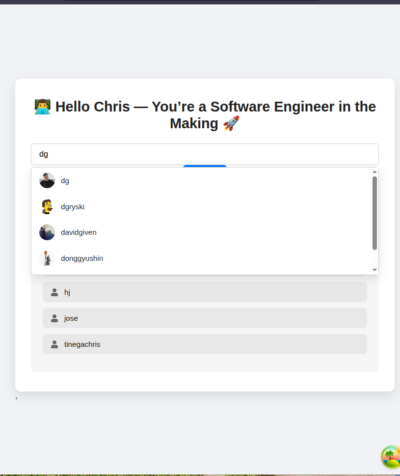

Built with **React**, **TypeScript**, and **TanStack React Query** for smooth data fetching and caching.

---



## 🚀 Features

* 🔎 **Search GitHub Users** by username
* 👤 **View Profile Info** (avatar, bio, followers, repos, etc.)
* ❤️ **Follow/Unfollow Users** directly
* 🕐 **Recent Searches** saved locally
* ⚡ **Debounced Search Suggestions** as you type
* 💾 **Data Caching** using React Query for instant reloads

---

## 🛠️ Tech Stack

| Category             | Tools Used                 |
| -------------------- | -------------------------- |
| **Frontend**         | React (Vite) + TypeScript  |
| **Data Fetching**    | TanStack React Query       |
| **UI/UX**            | TailwindCSS                |
| **API**              | GitHub REST API            |
| **State Management** | React hooks + localStorage |
| **Utilities**        | use-debounce               |

---

## 📦 Installation & Setup

```bash
# Clone the repo
git clone https://github.com/<your-username>/<your-repo-name>.git

# Move into the project folder
cd <your-repo-name>

# Install dependencies
npm install

# Add your environment variable
echo "VITE_GITHUB_API_URL=https://api.github.com" > .env

# Run the development server
npm run dev
```

Then open [http://localhost:5173](http://localhost:5173) in your browser 🚀

---

## 📁 Folder Structure

```
src/
 ├── api/
 │   └── github.ts       # Handles API requests
 ├── components/
 │   ├── UserCard.tsx
 │   ├── UserSearch.tsx
 │   └── RecentSearches.tsx
 ├── types/
 │   └── index.ts
 ├── App.tsx
 └── main.tsx
```

---

## 🌐 API Reference

### 🔸 Get Single User

```
GET https://api.github.com/users/{username}
```

### 🔸 Search Users

```
GET https://api.github.com/search/users?q={query}
```

---

## 🧠 How It Works

1. User types a GitHub username → app **debounces** input
2. `TanStack Query` triggers `searchGithubUser()`
3. Suggestions are shown dynamically
4. Clicking a name fetches detailed profile via `fetchGithubUser()`
5. Data stays cached — no reloading or flickering 🎯

---

## 📸 Screenshot (optional)

> *(Insert an image preview of your app here)*

---

## 🙌 Acknowledgements

* [GitHub REST API](https://docs.github.com/en/rest)
* [TanStack React Query](https://tanstack.com/query)
* [Vite](https://vitejs.dev/)

---

## 👨‍💻 Author

**Tinega Chrisantus**
📧 [tinegachris797@gmail.com](mailto:tinegachris797@gmail.com)
🌍 [GitHub Profile](https://github.com/tinegachris-o)

---

